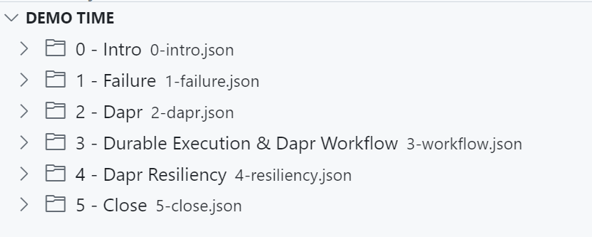
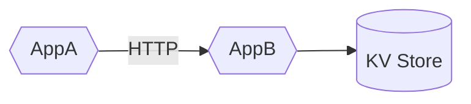
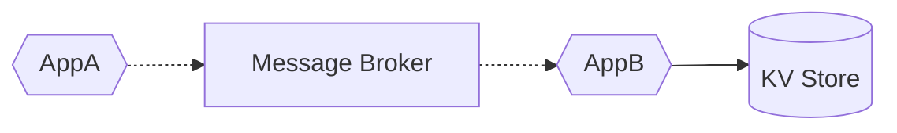
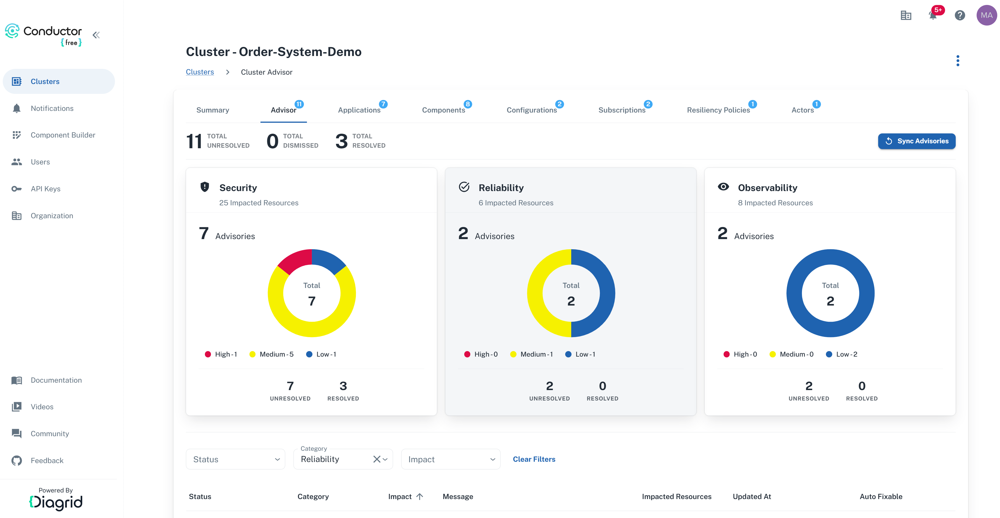
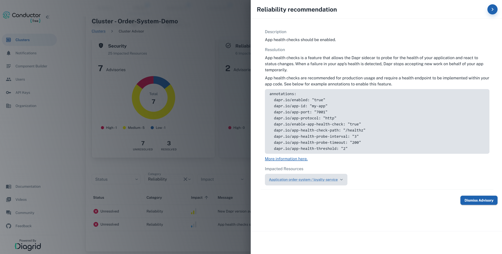
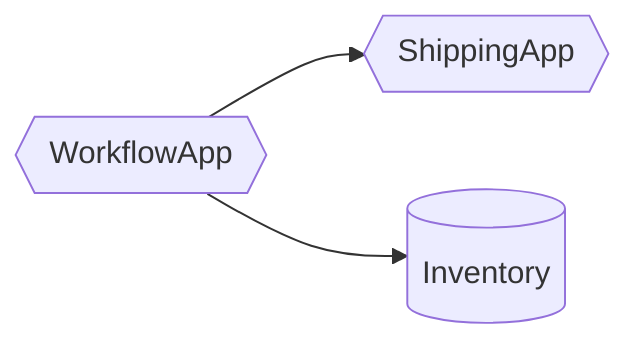
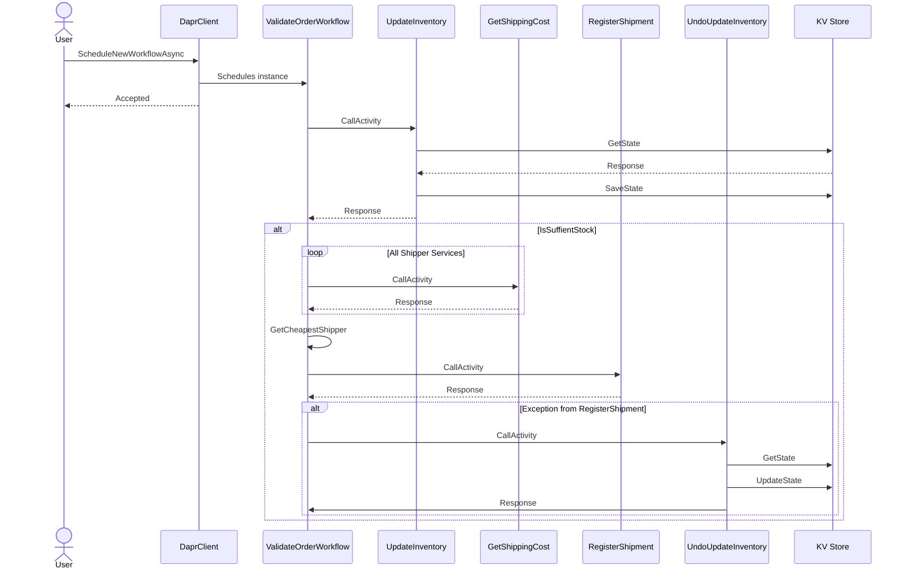

# Dapr Resiliency and Durable Execution

This repo contains Dapr applications to demonstrate Dapr resiliency policies and durable execution with Dapr workflow.

> Running the demos with Demo Time in this repo is recommended since this gives more context about:
>
> - failure and distributed computing challenges
> - the way Dapr provides resiliency
> - what durable execution is
> - how the Dapr Workflow implements durable execution

## Table of Contents

- [Prequisites](#prerequisites)
- [Run the Resiliency demo with Demo Time](#run-the-resiliency-demo-with-demo-time)
- [ResiliencyDemo](#resiliencydemo)
- [Dapr Reliability Advisor in Conductor Free](#dapr-reliability-advisor-in-conductor-free)
- [Run the Durable Execution & Workflow demo with Demo Time](#Run-the-durable-execution--workflow-demo-with-demo-time)
- [WorkflowDemo](#workflowdemo)
- [Resources](#resources)

## Prerequisites

You can choose to run the demos locally, which requires that you install the required dependencies yourself. Or you use the provided devcontainer that contains all required dependencies.

### Run locally without the devcontainer

Ensure you have these installed on your machine:

- [.NET 8](https://dotnet.microsoft.com/download/dotnet/8.0)
- [Dapr CLI](https://docs.dapr.io/getting-started/install-dapr-cli/)
- [Docker Desktop](https://www.docker.com/products/docker-desktop/)
- [VSCode](https://code.visualstudio.com/) - Although other IDEs can be used to view the code, some VSCode specific extensions are used (such as [DemoTime](https://marketplace.visualstudio.com/items?itemName=eliostruyf.vscode-demo-time)) to help guide you through the codebase.

### Run with the devcontainer

Ensure you have these installed on your machine:

- [Docker Desktop](https://www.docker.com/products/docker-desktop/)
- [VSCode](https://code.visualstudio.com/) - Although other IDEs can be used to view the code, some VSCode specific extensions are used (such as [Demo Time](https://marketplace.visualstudio.com/items?itemName=eliostruyf.vscode-demo-time)) to help guide you through the codebase.
- [Dev Containers Extension](https://marketplace.visualstudio.com/items?itemName=ms-vscode-remote.remote-containers) to run the devcontainer in VS Code.

The devcontainer configuration is using a .NET 8 image and includes the Dapr CLI and the required VS Code extensions.

### Clone the repo

Clone the [dapr-resiliency-and-durable-execution repo](https://github.com/diagrid-labs/dapr-resiliency-and-durable-execution) to your local machine.

Open the cloned repo in VSCode and accept the suggested VSCode extensions or choose to open the repo in the devcontainer.

### Run the Resiliency demo with Demo Time

Using the Demo Time panel in the VSCode explorer, start the *4 - Dapr Resiliency* demo:



### ResiliencyDemo

The ResiliencyDemo consists of two applications, AppA and AppB, and a state store.

Communication between AppA and AppB can be done using HTTP or Pub/Sub.

**Service invocation**



**Pub/sub**



### Running the ResiliencyDemo apps locally

1. Navigate to the ResiliencyDemo folder in the terminal:

    ```bash
    cd ResiliencyDemo
    ```

2. Run the ResiliencyDemo apps using the Dapr CLI:

    ```bash
    dapr run -f .
    ```

3. Open the [local.http](./ResiliencyDemo/local.http) file in the VSCode editor and execute the HTTP requests to the ResiliencyDemo apps.

### Dapr Reliability Advisor in Conductor Free

[Diagrid Conductor Free](https://www.diagrid.io/conductor) is a free tool developers can use to visualize, troubleshoot, and optimize Dapr workloads on Kubernetes. It includes an Advisor that provides recommendations on how to improve the reliability of your Dapr applications.





## Run the Durable Execution & Workflow demo with Demo Time

Using the Demo Time panel in the VSCode explorer, start the *3 - Durable Execution & Workflow* demo:


### WorkflowDemo






### Running the WorkflowDemo locally

1. Navigate to the WorkflowDemo folder in the terminal:

    ```bash
    cd WorkflowDemo
    ```

2. Run the WorkflowDemo apps using the Dapr CLI:

    ```bash
    dapr run -f .
    ```

3. Open the [local.http](./WorkflowDemo/local.http) file in the VSCode editor and execute the HTTP requests to the WorkflowDemo apps.

## Resources

- [Diagrid blog: An in-depth guide to Dapr workflow patterns in .NET](https://www.diagrid.io/blog/in-depth-guide-to-dapr-workflow-patterns)
- [Diagrid Conductor Free](https://www.diagrid.io/conductor)
- [Dapr Docs: Workflow](https://docs.dapr.io/developing-applications/building-blocks/workflow/workflow-overview/)
- [Dapr Docs: Resiliency](https://docs.dapr.io/operations/resiliency/)