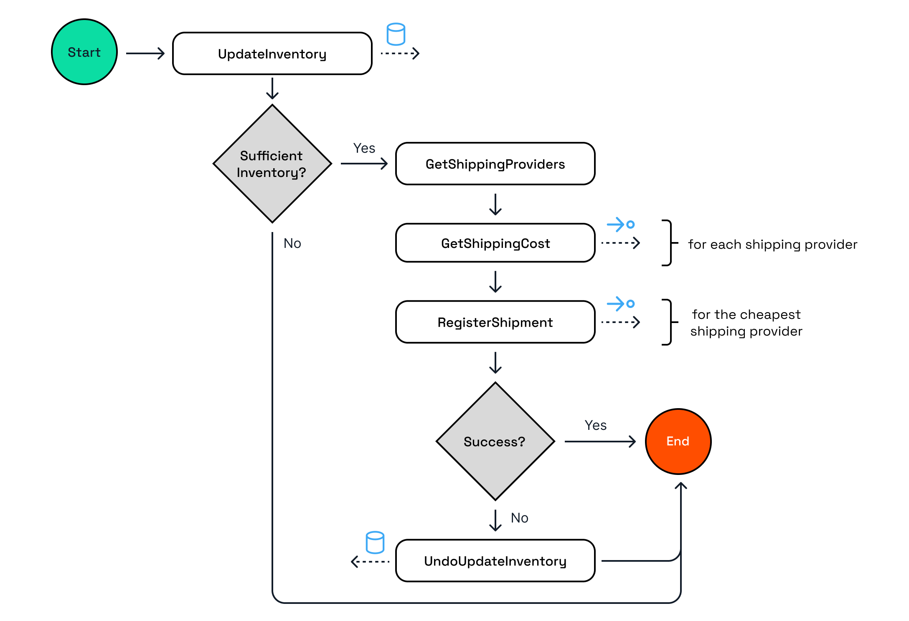

# Dapr Resiliency and Durable Execution

This repo contains Dapr applications to demonstrate Dapr resiliency policies and durable execution with Dapr workflow.

> Running the demos with Demo Time in this repo is recommended since this gives more context about:
>
> - failure and distributed computing challenges
> - what durable execution is
> - how the Dapr Workflow implements durable execution
> - the way Dapr provides resiliency

## Table of Contents

- [Prequisites](#1---prerequisites)
- [Run the Durable Execution & Workflow demo with Demo Time](#3---run-the-durable-execution--workflow-demo-with-demo-time)
- [Run the Resiliency demo with Demo Time](#4---run-the-resiliency-demo-with-demo-time)
- [Dapr Reliability Advisor in Conductor Free](#5---dapr-reliability-advisor-in-conductor-free)
- [Dapr Workflow Composer](#6---dapr-workflow-composer)
- [Resources](#7---resources)

## 1 - Prerequisites

You can choose to run the demos locally, which requires that you install the required dependencies yourself. Or you use the provided devcontainer that contains all required dependencies.

### 1a - Run locally without the devcontainer

Ensure you have these installed on your machine:

- [.NET 9](https://dotnet.microsoft.com/download/dotnet/9.0)
- [Dapr CLI](https://docs.dapr.io/getting-started/install-dapr-cli/)
- [Docker Desktop](https://www.docker.com/products/docker-desktop/)
- [VSCode](https://code.visualstudio.com/) - Although other IDEs can be used to view the code, some VSCode specific extensions are used (such as [DemoTime](https://marketplace.visualstudio.com/items?itemName=eliostruyf.vscode-demo-time)) to help guide you through the codebase.

### 1b - Run with the devcontainer

Ensure you have these installed on your machine:

- [Docker Desktop](https://www.docker.com/products/docker-desktop/)
- [VSCode](https://code.visualstudio.com/) - Although other IDEs can be used to view the code, some VSCode specific extensions are used (such as [Demo Time](https://marketplace.visualstudio.com/items?itemName=eliostruyf.vscode-demo-time)) to help guide you through the codebase.
- [Dev Containers Extension](https://marketplace.visualstudio.com/items?itemName=ms-vscode-remote.remote-containers) to run the devcontainer in VS Code.

The devcontainer configuration is using a .NET 9 image and includes the Dapr CLI and the required VS Code extensions.

### 2 - Clone the repo

Clone the [dapr-resiliency-and-durable-execution repo](https://github.com/diagrid-labs/dapr-resiliency-and-durable-execution) to your local machine.

Open the cloned repo in VSCode and accept the suggested VSCode extensions or choose to open the repo in the devcontainer.

## 3 - Run the Durable Execution & Workflow demo with Demo Time

The WorkflowDemo consists of two applications; a WorkflowApp, a ShippingApp, and a state store.

The workflow simulates an order validation process that involves checking and updating the inventory, retrieving shipping costs, and registering the shipment with the cheapest shipment provider:

Using the Demo Time panel in the VSCode explorer, start the *3 - Durable Execution & Workflow* demo:

## 4 - Run the Resiliency demo with Demo Time

The ResiliencyDemo consists of two applications, ValidationService and ProfileService, and a state store.

Using the Demo Time panel in the VSCode explorer, start the *4 - Dapr Resiliency* demo:

## 5 - Dapr Reliability Advisor in Conductor Free

[Diagrid Conductor Free](https://www.diagrid.io/conductor) is a free tool developers can use to visualize, troubleshoot, and optimize Dapr workloads on Kubernetes. It includes an Advisor that provides recommendations on how to improve the reliability of your Dapr applications.

## 6 - Dapr Workflow Composer

Try the [Dapr Workflow Composer](https://workflows.diagrid.io/), a free tool where you can upload a workflow image, or draw one in the browser, and scaffold a complete workflow application.

## 7 - Resources

- [New to Dapr Workflow? Try this free Dapr University track](https://diagrid.io/dapr-university)
- [Diagrid blog: An in-depth guide to Dapr workflow patterns in .NET](https://www.diagrid.io/blog/in-depth-guide-to-dapr-workflow-patterns)
- [Diagrid Conductor Free](https://www.diagrid.io/conductor)
- [Dapr Docs: Workflow](https://docs.dapr.io/developing-applications/building-blocks/workflow/workflow-overview/)
- [Dapr Docs: Resiliency](https://docs.dapr.io/operations/resiliency/)